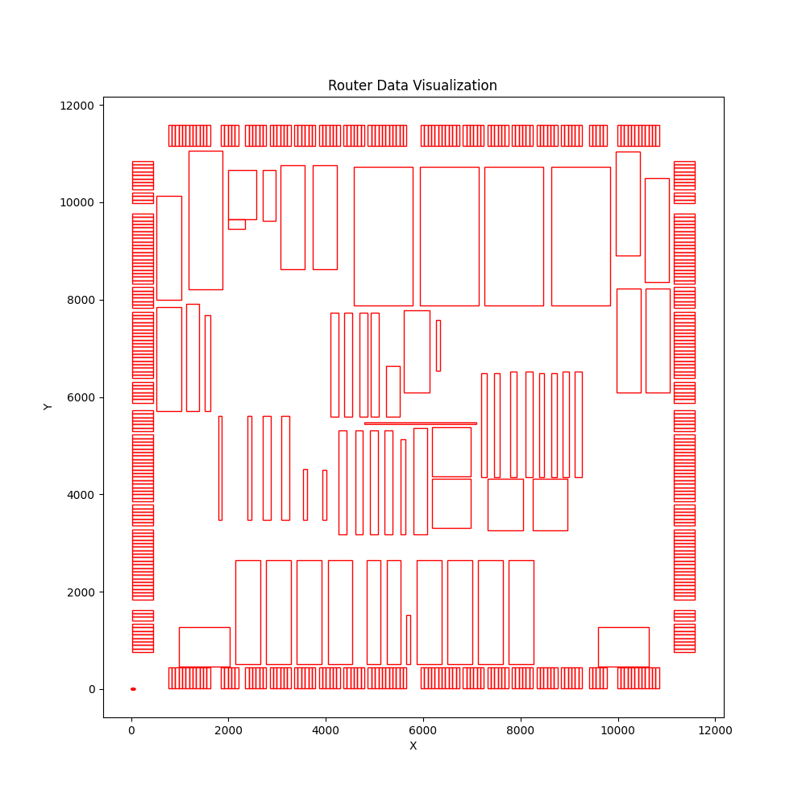

# ICCAD-Contest-Visualization

After search on the Internet, I still can not find a project to visualize it. So I plan to do it here.
If you like my project, please give a 🌟， I would appreciate it.

- 2015 CAD Contest: http://iccad-contest.org/2015/problem_D/default.html


1. install requirements.txt
```bash
pip install requirements.txt
```

2. make a data to visuale 

- File format :
  - adaptec1.pl
  - adaptec1.nodes

3. change the `data_dir` in `main.py` accordingly, then run:
```
python main.py
```
Then you get:
